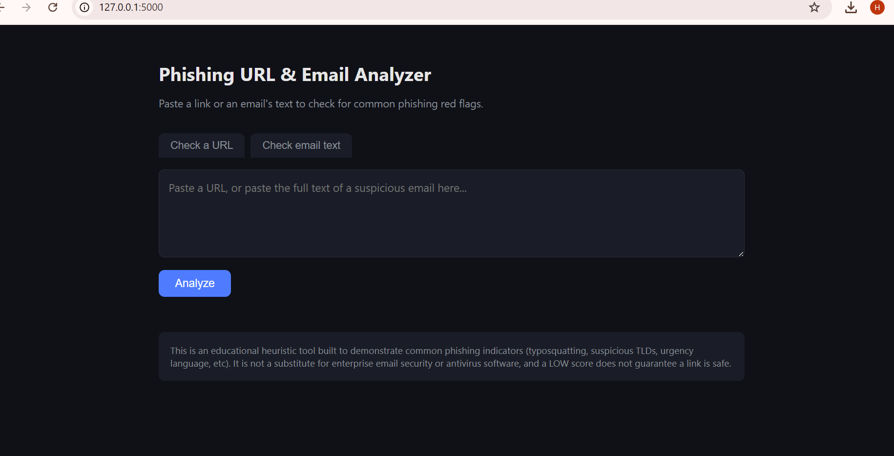

# Phishing URL & Email Analyzer

A Python tool that analyzes URLs and email text for common phishing red flags,
based on the social-engineering and cyber-defense patterns covered in my
thesis, *"The Importance of Social Engineering and Human Behaviour in Cyber
Defence."*

It uses rule-based heuristics — the same kinds of indicators taught in
security-awareness training — rather than a black-box ML model, so every
result comes with a clear, human-readable explanation of *why* something was
flagged.

## Features

- **URL analysis** — checks for:
  - Raw IP addresses instead of domain names
  - `@` symbol tricks that hide the real destination
  - Missing HTTPS
  - Abused/suspicious top-level domains (`.tk`, `.xyz`, `.top`, etc.)
  - Excessive subdomains or hyphens
  - URL shorteners
  - **Typosquatting / brand impersonation** — detects lookalike domains
    (e.g. `paypa1-secure-login.tk`) using Levenshtein edit-distance against
    a list of commonly impersonated brands
  - Suspicious keywords in the URL path (`verify`, `login`, `confirm`, etc.)
- **Email text analysis** — scans pasted email text for:
  - Any embedded URLs (each analyzed individually as above)
  - Urgency / social-engineering language ("act now", "your account will be
    suspended", "verify your identity", etc.)
- Returns a **0–100 risk score** and a **LOW / MEDIUM / HIGH** rating with
  reasons for every flag
- Simple web interface (Flask) — paste a link or email text and get an
  instant assessment
- Unit-tested core logic (12 tests covering detection rules and edge cases)


## Tech Stack

- Python 3
- Flask (web interface)
- `unittest` (test suite)
- No external APIs — fully self-contained, works offline

## Project Structure

```
phishing-analyzer/
├── phishing_checker.py       # Core detection logic (heuristics engine)
├── app.py                     # Flask web app
├── test_phishing_checker.py   # Unit tests
├── templates/
│   └── index.html              # Web UI
├── requirements.txt
└── README.md
```

## Setup

```bash
git clone https://github.com/<your-username>/phishing-analyzer.git
cd phishing-analyzer
pip install -r requirements.txt
```

## Usage

### Web interface

```bash
python app.py
```

Open **http://127.0.0.1:5000**, paste a URL or a block of email text, and
get an instant risk assessment.

### Command line / quick test

```bash
python phishing_checker.py
```

Runs a demo against a handful of sample URLs and prints the results.

### Running tests

```bash
python -m unittest test_phishing_checker.py -v
```

## Example

Input: `http://paypa1-secure-login.tk/verify-account`

```
Risk: HIGH (score: 75/100)
- Does not use HTTPS encryption
- Uses a top-level domain often associated with abuse (.tk)
- Domain contains multiple hyphens, common in lookalike domains
- Domain closely resembles the brand 'paypal' (possible typosquat)
- URL path contains words commonly used in phishing links
```

## Why I Built This

My thesis focused on how human behaviour — not just technical
vulnerabilities — is often the weakest link in cyber defence. Most phishing
attacks succeed by exploiting urgency, trust, and inattention rather than
software flaws. I wanted to build something practical that reflects that:
a tool that explains *why* a link looks suspicious in plain language, the
same way a security-awareness trainer would, rather than just outputting a
black-box score.

## Possible Extensions

- Real-time domain age / WHOIS lookup (very new domains are higher risk)
- SPF/DKIM/DMARC header analysis for full email files (.eml)
- Browser extension version for real-time link checking
- Expandable brand list loaded from a config file

## Author

Rahat Abbas Hussain Hussain — ICT graduate, Turku University of Applied
Sciences. Thesis: *The Importance of Social Engineering and Human Behaviour
in Cyber Defence.*
